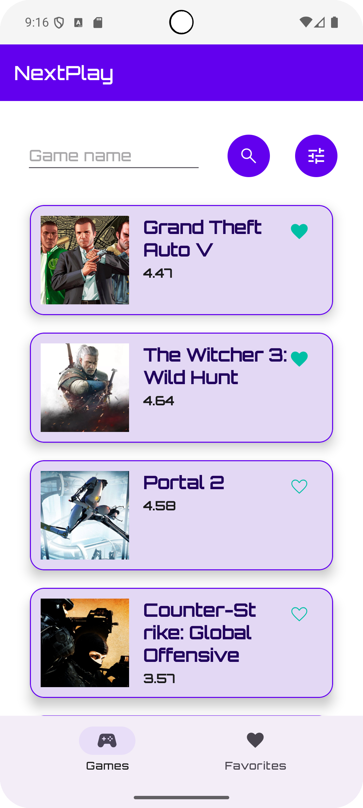

# NextPlay: Tu Próximo Juego Favorito

NextPlay es una aplicación Android nativa diseñada para ayudar a los jugadores a descubrir nuevos videojuegos. La aplicación consume la API pública de [RAWG.io](https://rawg.io/apidocs) para mostrar un extenso catálogo de juegos, permitiendo a los usuarios buscar, filtrar y organizar la información según sus preferencias.

## Características Principales

*   **Catálogo de Juegos**: Explora una lista infinita de videojuegos con imágenes, puntuación (rating) y plataformas.
*   **Búsqueda Avanzada**: Encuentra juegos específicos por su nombre.
*   **Filtros Detallados**:
    *   Filtra el catálogo por uno o varios **géneros**.
    *   Filtra por una o varias **plataformas**.
*   **Ordenamiento Personalizado**: Organiza los resultados por:
    *   Orden alfabético.
    *   Fecha de lanzamiento.
    *   Puntuación (rating).
*   **Lista de Favoritos**: Guarda los juegos que te interesan en una lista de favoritos persistente para consultarla más tarde.
*   **Interfaz Moderna**: Construida con Material Design 3, ofreciendo una experiencia de usuario limpia e intuitiva.

## Tecnologías y Arquitectura

Este proyecto sigue las mejores prácticas recomendadas por Google para el desarrollo de aplicaciones Android modernas.

*   **Lenguaje**: [Kotlin](https://kotlinlang.org/) 100%, aprovechando coroutines y flow para el manejo de asincronía.
*   **Arquitectura**:
    *   **MVVM (Model-View-ViewModel)**: Separa la lógica de la UI de la lógica de negocio.
    *   **Arquitectura Limpia (Clean Architecture)**: Organizada en capas (`data`, `domain`, `ui`) para un código desacoplado, escalable y fácil de mantener.
    *   **Single-Activity Architecture**: Usa el componente [Navigation](https://developer.android.com/guide/navigation) para gestionar los diferentes fragmentos dentro de una única actividad principal.
*   **Componentes de Android Jetpack**:
    *   **UI**: [Vistas XML](https://developer.android.com/guide/topics/ui/declaring-layout) con `ConstraintLayout` y `RecyclerView`.
    *   **ViewModel**: Gestiona el estado de la UI y sobrevive a cambios de configuración.
    *   **Lifecycle**: Permite que los componentes reaccionen a los cambios en el ciclo de vida.
    *   **Room**: Base de datos local para persistir la lista de juegos favoritos.
*   **Inyección de Dependencias**: [Hilt](https://developer.android.com/training/dependency-injection/hilt-android) para simplificar la inyección de dependencias y la gestión de instancias.
*   **Red (Networking)**:
    *   [Retrofit](https://square.github.io/retrofit/): Cliente HTTP para realizar las llamadas a la API de RAWG.
    *   [GSON](https://github.com/google/gson): Para deserializar las respuestas JSON en objetos de Kotlin.
*   **Manejo de Imágenes**: [Glide](https://github.com/bumptech/glide) para cargar, cachear y mostrar imágenes de la red de forma eficiente.

## Cómo Empezar

Para compilar y ejecutar el proyecto, necesitarás:

1.  **Android Studio**: La versión más reciente recomendada (por ejemplo, Iguana o superior).
2.  **API Key de RAWG**:
    *   Regístrate en [rawg.io/apikey](https://rawg.io/apikey) para obtener tu clave de API gratuita.
    *   Una vez obtenida, agrégala en el archivo `local.properties` para mantenerla segura:
        
